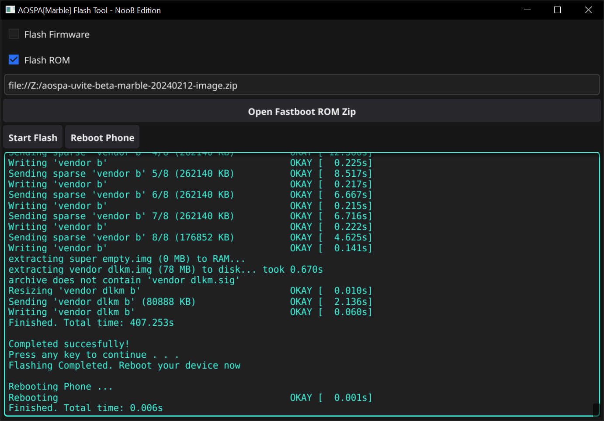

# AOSPA Fastboot Flashing Kit - Marble Edition

AOSPA Fastboot Flashing Kit is a material UI based helper tool to allow users to flash aospa(paranoid) custom rom on their Marble device. No more CLI invocation is needed to switch to experience AOSPA.

Features:
- Less errorprone
- Basic firmware validation
- Easy UI

## Disclaimer

> NOTE: USE AT YOUR OWN RISK  

Flashing wrong firmware or ROM files could brick your device. Be cautious about the action you perform.

## Requirements

Intel/AMD processor enabled PC/Laptop running Windows/Linux/Mac. 

The system must also have the required USB and fastboot drivers preinstalled.

## Installation
Download the binary from Releases specific to your operating system. 

## Usage
Download the required firmware and fastboot ROM file from aospa.co. 

Boot your phone to Fastboot mode. (Power + Volume Down)

&#8594; Step1: Check Flash Firmware and select the firmware zip file (Skip this - if already on recommended firmware)

&#8594; Step2: Check Flash ROM and select the rom zip file

&#8594; Step3: Click the Flash button.

Once the  flashing is completed. Click Reboot button.

Flashing might take 5 to 10 minutes depending on the underlying hardware.

## Limitations
- No realtime output. Log output displayed as buffered streams which comes with some delay.

## Roadmap
- allow driver installation on windows
- Support kernel flashing from fastboot
- more validation logic to prevent user flashing incorrect files

## Authors and acknowledgment
This project is not possible without the [engine](https://github.com/ghostrider-reborn/aospa-flashing-kit) created by ghostrider-reborn.

## License
Licensed under GPL